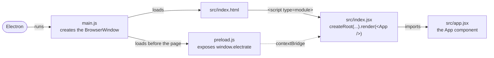

# Electrate

<p align="center">
  
</p>

This is a simple [Electron](https://electronjs.org/) + [React](https://react.dev/) template (with live reload), built with [electron-vite](https://electron-vite.org/). In development the renderer is served by the Vite dev server, so CSS changes apply instantly and React component edits apply in place with Fast Refresh, keeping component state; the packaged app loads the bundled renderer from disk. The original design is explained [in my article on Medium](https://medium.com/@michael.m/creating-an-electron-and-react-template-5173d086549a).

## Installing

To clone and run this repository you'll need [Git](https://git-scm.com) and [Node.js](https://nodejs.org/en/download/) 22.18 or later (which comes with [npm](https://www.npmjs.com/)) installed on your computer; `.nvmrc` pins the version CI uses. From your command line:

```bash
# Clone this repository
git clone https://github.com/mmick66/electrate my-app
# Go into the repository
cd my-app
# Install dependencies
npm install
```

## Running

```bash
npm start
```

This starts the Vite dev server and opens the app in Electron.

## Testing

Tests run with [Jest](https://jestjs.io/docs/tutorial-react) in a [jsdom](https://github.com/jsdom/jsdom) environment, and React components are tested with [React Testing Library](https://testing-library.com/docs/react-testing-library/intro/) (see `src/app.test.jsx`). Create files with the extension `*.test.js` (`*.test.jsx` if they contain JSX) and they will be run through

```bash
npm test
```

## Linting

[ESLint](https://eslint.org/) (configured in `eslint.config.mjs`) checks the code and [Prettier](https://prettier.io/) formats it; CI runs both (`npm run format:check`).

```bash
npm run lint
npm run format
```

## Packaging

Replace `build/icon.png` with your own icon (a square PNG, at least 1024x1024) and run

```bash
npm run release
```

Check the `dist` folder for the app. [electron-builder](https://www.electron.build/icons) generates the macOS, Windows and Linux icons from that one PNG.

## How Electron Works with React

[electron-vite](https://electron-vite.org/) bundles `main.js` into `out/main` and the renderer (`src/index.html` with its scripts and styles) into `out/renderer`; files in `src/public` are copied as they are. `npm start` runs the dev server and restarts Electron when `main.js` changes, `npm run build` writes `out`, and `npm run release` packages `out` with [electron-builder](https://www.electron.build/). The configuration is in `electron.vite.config.mjs`.

The renderer runs sandboxed with context isolation and no Node.js access, under a strict Content Security Policy (set in `src/index.html`). Anything it needs from Node or Electron goes through `preload.js`, which exposes a small API on `window.electrate` with `contextBridge`.



## Extending the Template

Some useful tools include:

1. [Playwright](https://playwright.dev/docs/api/class-electron), for end-to-end tests that launch and drive the Electron app
2. [Ant Design](https://ant.design/) (a React based UI Framework)

## Copyright

The template is made available through the [Creative Commons Licence](https://creativecommons.org/publicdomain/zero/1.0/). The logo icon was provided by [Vecteezy](https://www.vecteezy.com/).
